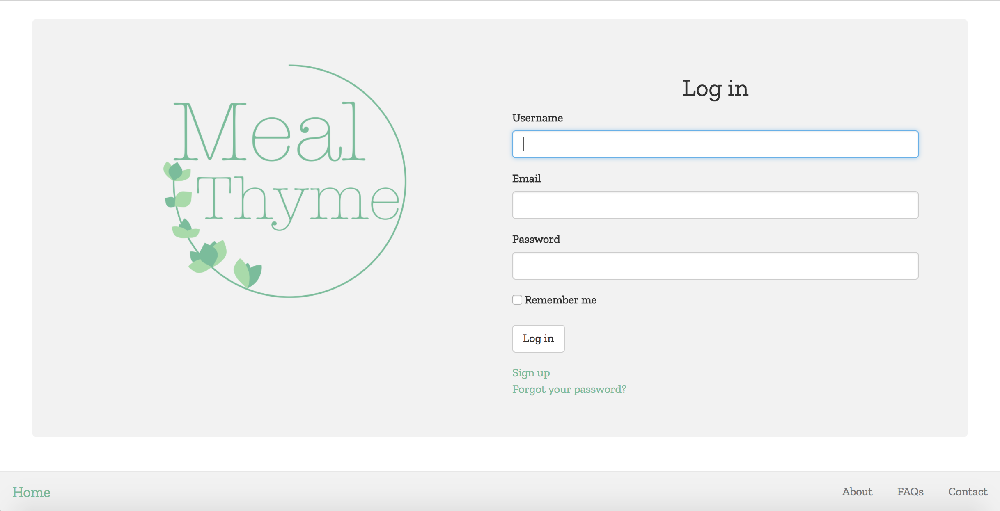

# Meal-Thyme

#### _Nicky Santamaria_

## Description

An meal planning app. [Heroku](https://meal-thyme.herokuapp.com/)

## Technologies Used / Prerequisites

* [Ruby](https://www.ruby-lang.org/en/downloads/)
* [Rails](http://rubyonrails.org/)
* [PostgreSQL](https://www.postgresql.org/docs/9.2/static/app-psql.html)
* [Git](https://git-scm.com/)
* [Materialize](http://materializecss.com/)
* AJAX

## Installation

* `$ git clone https://github.com/nrsantamaria/meal-thyme`
* `$ cd meal-thyme`

## PostgreSQL Integration
* `$ postgres`
* `$ rake db:create`
* `$ rake db:migrate db:test:prepare`

## Seed database
* `$ rake db:seed`

## Email set up
* Create an .env file and Procfile in your root directory, add the following:
```
_meal-thyme/.env_
GMAIL_DOMAIN=yoururl.com
GMAIL_USERNAME=support@yoururl.com
GMAIL_PASSWORD=password12345

_meal-thyme/Procfile_
web: bundle exec rails s

```

## Development server

Run `rails s` for a dev server. Navigate to `http://localhost:3000/`. The app will automatically reload if you change any of the source files.

## Specifications

| Behavior |  Input   |  Output  |
|----------|:--------:|:--------:|
|User can create an account.|||
|User can login to an account.|||
|User can look through a list of recipes|||
|User can add 3 recipes to a day|||
|Grocery list feature so users can add ingredients from recipes to a grocery list|||
|Grocery list can be emailed to a user.|||
|User will add specific dietary needs during account set up.|||
|Base recipe options on user parameters|||
|FAQ page, how to use system|||
|About page, goal and contact info.|||

## Resources
* [DeviseMailer](https://rubyonrailshelp.wordpress.com/2014/01/02/setting-up-mailer-using-devise-for-forgot-password/)
* [SimpleCalendar](http://excid3.github.io/simple_calendar/)

## Known Bugs
* N/A

## License

*This software is licensed under MIT license.*

```
Copyright (c) 2017 Nicky Santamaria
```
<!-- future home of some screenshots :)
## Home Page
 -->
