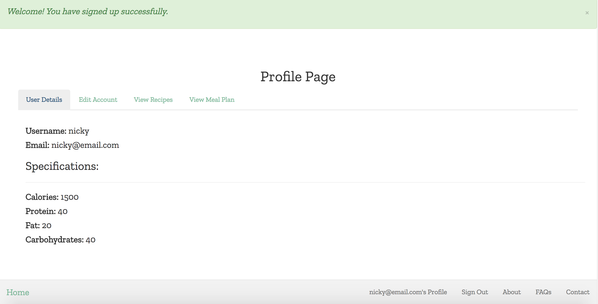
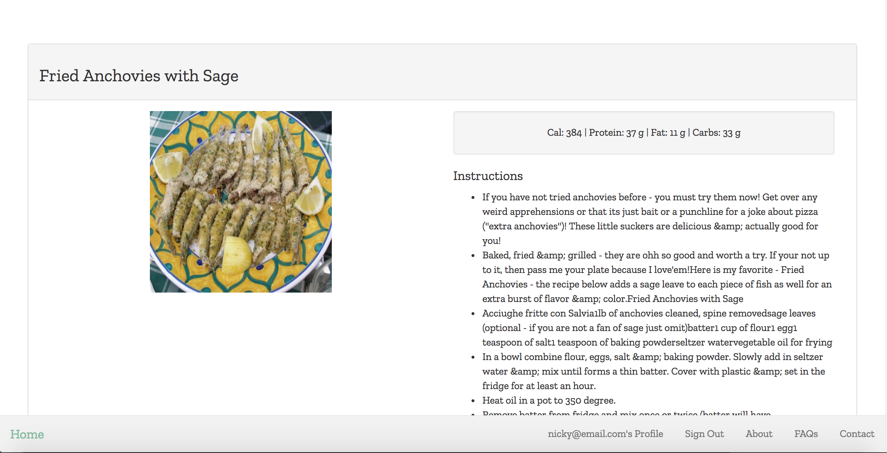
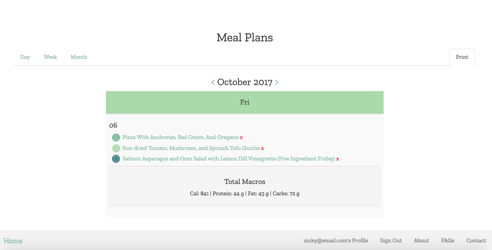

# Meal-Thyme

#### _Nicky Santamaria_

## Description

An meal planning app. [Heroku](https://meal-thyme.herokuapp.com/)

## Technologies Used / Prerequisites

* [Ruby](https://www.ruby-lang.org/en/downloads/)
* [Rails](http://rubyonrails.org/)
* [PostgreSQL](https://www.postgresql.org/docs/9.2/static/app-psql.html)
* [Git](https://git-scm.com/)
* AJAX

## Installation

* `$ git clone https://github.com/nrsantamaria/meal-thyme`
* `$ cd meal-thyme`

## PostgreSQL Integration
* `$ postgres`
* `$ rake db:create`
* `$ rake db:migrate db:test:prepare`

## Seed database
* `$ rake db:seed`

## Email set up
* Create an .env file and Procfile in your root directory, add the following:
```
meal-thyme/.env

GMAIL_DOMAIN=yoururl.com
GMAIL_USERNAME=support@yoururl.com
GMAIL_PASSWORD=password12345

meal-thyme/Procfile

web: bundle exec rails s

```

## Development server

Run `rails s` for a dev server. Navigate to `http://localhost:3000/`. The app will automatically reload if you change any of the source files.

## Specifications

| Behavior |  Input   |  Output  |
|----------|:--------:|:--------:|
|User can create an account.|||
|User will add specific dietary needs during account set up.|||
|User can login to an account.|||
|User can look through a list of recipes.|||
|User can add a recipe to a day.|||
|Calendars appear on user page.|||
|User can remove a meal from calendar.|||
|User can see total macros for a day on calendar.|||
|Icons are used on calendar for meal type and include recipe title.|||

## Further Exploration
* Filter on recipes page by dietary restrictions.
* Search feature on recipes page by ingredients.
* Specific calendar appear on user page using buttons for three different view options (hide/show feature).
* Base recipe options on user parameters.
* Sort meal plan on day Breakfast, Lunch, Dinner.
* Grocery list feature so users can add ingredients from recipes to a grocery list.
* Grocery list can be emailed to a user.
* Devise confirmation for account set up.
* Redirects (all paths that can only be accessed after login i.e. recipes path)

## Resources
* [DeviseMailer](https://rubyonrailshelp.wordpress.com/2014/01/02/setting-up-mailer-using-devise-for-forgot-password/)
* [SimpleCalendar](http://excid3.github.io/simple_calendar/)
* [ContactForm](https://rubyonrailshelp.wordpress.com/2014/01/08/rails-4-simple-form-and-mail-form-to-make-contact-form/)
* [API](https://market.mashape.com/spoonacular/recipe-food-nutrition#search-recipes-complex)

## Known Bugs
* Macros error message will appear if over 100. Success message will also appear but cannot login.
* Rendering issue for AJAX request on calendars when using the previous or next link.

## License

*This software is licensed under MIT license.*

```
Copyright (c) 2017 Nicky Santamaria
```

## Home Page

## Profile Page

## Recipes Page

## Recipe Page

## Meal Plan Page

